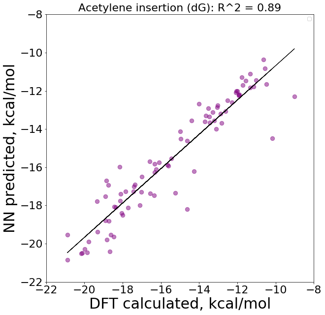

# Core Generation
To generate scaffolds that are going to be functionalized with substituents, we need to create a simple input file, *input_file.in*:

```markdown
-core au
-geometry oct
-coord 4
-lig CCN,acetate
-ligocc 1 1
-ff MMFF94
-ffoption BA
-spin 1
-oxstate III
-keepHs yes
-name CCNAu_OAc
```

In this example, the input file named *CCNAu_OAc.in* is going to be assembled. The complex will be constructed using two ligands – CCN and acetate, both imported from the library. The name of the output complex matches the name of the file – CCNAu_OAc. 
This file is passed to molSimplify program to assemble the complex as xyz-file with the name specified in the command “name”. 
The resulting geometry looks like this:


The same procedure is repeated for other 11 scaffolds. As a result, 12 scaffolds are generated:


*CCN_chn_Au_OAc.xyz*

*CCNAu_OAc.xyz*

*N_naph_cyclic_OAc.xyz*

*N_naph_py_Au_OAc.xyz*

*naphN_Ph_OAc.xyz*

*naphP_Ph_OAc.xyz*

*NHC_Ph_OAc.xyz*

*oxaz_Au_OAc.xyz*

*P_naph_cyclic_OAc.xyz*

*P_naph_py_Au_OAc.xyz*

*Ph_phtrAu_OAc.xyz*

*Tilset_Au_OAc.xyz*

These scaffolds represent “naked” frameworks to which the substituents are going to be introduced. 

# Introduction of Substituents

Let us assume that we want to generate a mono substituted CCNAu_OAc complex with a benzene ring in position 7. To do that we would simply set up an input file for *molSimplify* - *CCNAu_OAc_mono_7_benzene.in*. The resulted file would then be executed by *molSimplify* together with its “naked” scaffold *CCNAu_OAc.xyz*. The logic behind this is that *molSimplify* uses the xyz-complex CCNAu_OAc as a core, substitutes its hydrogen atom in the position 7 with benzene and saves the output geometry as *CCNAu_OAc_mono_7_benzene.xyz* file, as demonstrated in Fig. X.  

```markdown
-coord 6
-replig 1
-core CCNAu_OAc.xyz
-ligocc 1
-ccatoms 7
-lig benzene
-geometry oct
-spin 1
-oxstate III
-ff MMFF94
-ffoption Before
-name CCNAu_OAc_mono_7_benzene
-keepHs no
```

Generation of thousands of such complexes with different ligands, positions and scaffolds would require automatization and thus development of an algorithm that does the job for us. 
First define a ligand set. 
Two types of substituents (ligands) we are going to work with – deactivating and activating. In total, there is 10 defined substituents that are going to be introduced.


**General strategy:** generation of the input files for *molSimplify* (.in files) -> generation of the geometries (.xyz) from the input files. 
Before we move on, it is required to add the desired ligands to the molSimplify’s database. 
Naming – Core name + mono/double/triple + position + substituent + ins (if inserted).

## Mono Substitution

**Required files:** *mono_replacer.py*, replacing template (*replacer_mono.in*) and scaffold’s core xyz file (*CCNAu_OAc.xyz*).

```markdown
-coord 6
-replig 1
-core CCNAu_OAc.xyz
-ligocc 1
-ccatoms **rep_position**
-lig **ligand_name**
-geometry oct
-spin 1
-oxstate III
-ff MMFF94
-ffoption Before
-name **name_here**
-keepHs no
```

The structure of the *replacer_mono.in* is presented in a snippet above. The name of the core, CCNAu_OAc.xyz, needs to be added manually, depending on the scaffold that is going to be used for substituition. For example, if naphN_Ph_OAc is used for generation of substituted complexes, then its core should be specified as “naphN_Ph_OAc.xyz”. **rep_position** is a label of a hydrogen atom that is going to be replaced with a substituent (**ligand_name**). The complex is going to be saved as **name_here**, which is constructed when the python script *mono_replacer.py* is executed.

The structure of *mono_replacer.py* is presented below. The positions for substituents (**positions_lis**) are unique for each complex and have to be updated manually, each time the script is executed for a new scaffold. In this example, 11 positions in the scaffold CCNAu_OAc are going to be substituted with ligands, specified is **ligand_list**.  

```ruby
import os, shutil

#################################################
#
# "CCNAu_OAc_mono_" should be substituted with a name of the scaffold
# that this script is run on. For example, if the scaffold is naphP_Ph,
# then it should be changed to "naph_Ph_OAc_mono_"
#
#################################################


# defining the pathway to the script file
os.chdir("/Users/vladimirlevchenko/DokumenterHD/programming/Python")
os.chdir("Subs_maker_Ligs_and_Pos/replacers_UPDATED/mono")
print(os.getcwd())

# open a replacement template
f = open("replacer_mono.in","r")
template = f.read()
f.close


ligands_list = ["benzene",
                "bromide",
                "fluoride",
                "CH4",
                "nitro",
                "OMe",
                "phCO",
                "tBu",
                "phenol",
                "HSO2Me"]

positions_list = [28,30,29,26,19,9,7,16,14,20,11]

def substitutor_mono(ligands, positions):
    for i in ligands:
        for position in positions:
            #create dir with position as a name
            if not os.path.exists("mono_subs_input"): os.mkdir("mono_subs_input")
            #copy the file into the new dir
            shutil.copy("replacer_mono.in", str(position))
            os.chdir("mono_subs_input")

            #get the templ and replace the rep_position
            out = open("CCNAu_OAc_mono_"+str(position)+"_"+ str(i)+".in","w")
            template_out = template.replace("rep_position",
            str(position)).replace("name_here",
            str("CCNAu_OAc_mono_" + str(position)+"_"+str(i))).replace("ligand_name", i)

            out.write(template_out)
            out.close
            os.chdir("..")
            os.remove(str(position))


if __name__ == "__main__":
    substitutor_mono(ligands_list, positions_list)

```

Execution of the script *mono_replacer.py* results in a folder “mono_subs_input” with 111 (10 substituents x 11 positions) generated input files for *molSimplify*. To the generated folder with input files (mono_subs_input), we have to copy *CCNAu_OAc.xyz* and a bash script *from_in_to_xyz.sh* and execute the latter. The bash script will generate the geometry of the complexes located in the folder mono_subs_input into a new folder inside it, called “geometries_xyz”.
Generation of 100 complexes takes ca 10 min.  

```markdown
|---CCNAu
	|---mono_subst
		  --- mono_replacer.py (1st)
		  --- replacer_mono.in
		 |--- mono_subs_input
			  --- CCNAu_OAc.xyz (has to be copied here manually)
			  --- from_in_to_xyz.sh (2nd; has to be copied here manually)
			  --- CCNAu_OAc_mono_7_benzene.in
			  	 .
			  	 .
			  	 .
			  --- CCNAu_OAc_mono_30_tBu.in
		 	 |--- geometries_xyz
				    --- CCNAu_OAc_mono_7_benzene.xyz
					    .
					    .
					    .
				    --- CCNAu_OAc_mono_30_tBu.xyz
```

## Double Substitution

Introduction of two substituents to the scaffold can be achieved in two ways: homo- and heterosubstitution. In homosubstitution, both substituents are the same, for example two Cl or two iPr groups. In contrast to heterosubstitution, where two substituents can be different – F and Ph or Et and OH etc. The algorithms for both ways of substitution are slightly different and can be found in *hetero_double_replacer.py* and *homo_double_replacer.py*. In this project, we are going to use homosubstitution.

The input file for the substitution in a single scaffold results in double substituted CCNAu_OAc complex with two Br atoms in positions 30 and 28 (snippet below to the left). This input file can be generalized for the whole scaffold with positions, substituents and name as variables. By varying them, we can introduce as many substituents as we want in the desired positions and in the specified scaffold (snippet to the right):  

```markdown
-coord 6							-coord 6
-replig 1							-replig 1
-core CCNAu_OAc.xyz						-core **CCNAu_OAc.xyz**
-ligocc 1 1							-ligocc 1 1
-ccatoms 30,28							-ccatoms **position_1,position_2**
-lig bromide bromide						-lig **ligand_1 ligand_2**
-geometry oct							-geometry oct
-spin 1								-spin 1
-oxstate III							-oxstate III
-keepHs no no							-keepHs no no
-ff MMFF94							-ff MMFF94
-ffoption Before						-ffoption Before
-name CCNAu_OAc_double_bromide_bromide				-name **name_here**
```

Execution of the script *homo_double_replacer.py* creates a folder with 550 .in files, which are going to be used as input files for the geometry generation. The geometries are then generated executing *from_in_to_xyz.sh* bash script (remember the presence of the core structure, CCNAu_OAc.xyz in the running folder).  
The assembled geometries have specific names, which determine their composition, for example:
CCNAu_double_benzene_7_29_benzene.xyz – means the the core CCNAu_OAc is double substituted with benzene in position 7 and another benzene in position 29.


## Triple Substitution

Introduction of three substituents can be achieved by executing *triple_replacer.py*. One has to manually edit the postions that are going to be substituted. 

# Randomization of Complexes

In total it was produced **5180** complexes (*xyz* geometry files), arising from combination of 12 scaffolds, with mono- and double-substitution (homosubstitution) and 10 substituents. To proceed further with exploration of the complexes with machine learning, we have to **randomly** select 1000 complexes, which is achieved by executing *randomizer.py*. The script chooses random 1000 files and moves them into a new folder. The script also creates a text file with the names of the files that were randomly moved.

```ruby

import os, shutil
import random

os.chdir("Python/for_GitHub/randomizer")
current_path = os.getcwd()
print(current_path)

# number of randomly selected files
batch_size = 1000

random.seed(987)
# displays all files in the desired folder
files = os.listdir(current_path)
random.shuffle(files)
random_files_list = random.sample(files,k=batch_size)

if not os.path.exists("randomly_selected_files"): os.mkdir("randomly_selected_files")
with open("README_randomly_selected_files.txt","w") as f:
    f.write("Randomly selected files")
    f.write("\n")
    for element in range(len(random_files_list)):
        shutil.move(random_files_list[element], "randomly_selected_files")
        f.write(random_files_list[element])
        f.write("\n")
f.close()

```

The script has to be executed in the folder with all complexes (with 5180 *xyz* geometry files).

# Preparation to HPC subsmission

The next step is to assemble input files to send for DFT calculations to high-performance supercomputer (HPC). Each complex requires its own input file with specifications of the calculations. 

## For a single complex

**General strategy:** take template for DFT calculations -> insert the coordinates from xyz file; keep the same name of the complex -> create SLM file (to submit to HPC) -> submit to HPC (.com and .slm files) 

Attached picture below. Right - the input file for DFT calcualtions for complex named NHC_Ph_OAc_double_HSO2Me_13_18_HSO2Me. Generalized template of the input file to submit to the DFT calculations.


Each xyz file contains the geometry of the complex, which is then copied into the DFT_input_template.com file (field to substitute – “file name”). This DFT input file contains two sections: geometry optimization and single point calculations (followed after “—Link1—” command). Also, the file contains computation details, such as basis set (def2SVP), grid dimention and method (pbepbe). The complex’s geometry is first optimizaed in a gas phase and the optimized energy is then taken into the single point calculations, which are performed in acetic acid (HOAc). 

## For multiple complexes

The submission of multiple complexes requires assembly of numerous input files for DFT calculations (.com files). In contrast to the single calculation, submission of multiple files cannot be performed by file-by-file submission. The files should be send in packages, called batches. The batch contains from 20 to 40 files according to the computing power of the HPC. Also, each batch must contain one slm file specifying the names of the complexes to be submitted. 

**Required files:** *HPC_generator.py*, *DFT_input_template.com*, *SLM_template.slm*

The only thing that has to be done, is to copy the required files into the folder with xyz geometries and execute *HPC_generator.py*. 
Execution of *HPC_generator.py* results in folders “Batch_1, 2, … n” containing .com files and generated SLM file. 
NB! SLM_template.slm sould be deleted from a batch and does not need for a further submission.

The script *HPC_generator.py* consists of methods for DFT input generation, batch maker and creator of SLM files: 
```ruby
import os, shutil

os.chdir("Python/HPC_file_generator/DFT_and_batch_combined")
current_path = os.getcwd()
print(current_path)


# open a template input file for content reading
with open("DFT_input_template.com","r") as f:
    template = f.read()
f.close()


def DFT_input_generator():
    # Looping over .xyz files in the folder
    for filename in os.listdir(current_path):
        # and getting the name of the xyz files
        if filename.endswith(".xyz"):
            # names of the xyz files without the extension
            no_extension = os.path.splitext(filename)[0]

            # reading the xyz files and trimming of the first two lines
            with open(filename, "r") as xyz_file:
                template_fin2 = xyz_file.readlines()
            xyz_file.close()
            del template_fin2[:2]

            #creating a new file with the same name as given xyz file
            with open(no_extension + ".com", "w") as out:
                #and writing the contents of the input template to the new file with subs
                template_out = template.replace(
                "xyz_coordinates", ' '.join(template_fin2)).replace(
                "file_name",no_extension)
                out.write(template_out)
            out.close()
    os.mkdir("DFT_input_FROM_xyz")
    for filename in os.listdir(current_path):
        if filename.endswith(".com") and "template" not in filename:
            shutil.move(filename, "DFT_input_FROM_xyz")

    return "Successfully generated HPC input files"

def batch_maker(batch_size):
    os.chdir("DFT_input_FROM_xyz")

    folder_count = 1
    file = 1
    for filename in os.listdir(os.getcwd()):
        if filename.endswith(".com"):
            print("BATCHED", filename)
            if not os.path.exists("Batch_" + str(folder_count)): os.mkdir("Batch_" + str(folder_count))
            if file == batch_size + 1:
                folder_count += 1
                os.mkdir("Batch_" + str(folder_count))
                shutil.move(filename, "Batch_" + str(folder_count))
                file = 2
            else:
                shutil.move(filename, "Batch_" + str(folder_count))
                file += 1

def SLM_copy():
    for batch in os.listdir(os.getcwd()):
        print(batch)

        os.chdir("..")
        shutil.copy("SLM_template.slm", "DFT_input_FROM_xyz/" + str(batch))
        os.chdir("DFT_input_FROM_xyz")

def SLM_creator():
    for batch in os.listdir(os.getcwd()):
        print(batch)
        os.chdir(str(batch))

        with open("SLM_template.slm","r") as f:
            template = f.read()

            template = template.replace("batch_number", str(batch))

        f.close()


        with open("generated_SLIM.slm", "a") as f2:
            f2.write(template)
            f2.write("\n" * 2)
            f2.write("cd $SUBMITDIR" + "\n")

            for filename in os.listdir(current_path):
                if filename.endswith(".com"):
                    no_extension = os.path.splitext(filename)[0]
                    f2.write("cp " + str(no_extension) + ".com $GAUSS_SCRDIR" + "\n")

            f2.write("cd $GAUSS_SCRDIR" + "\n")
            f2.write("\n" * 2)

            for filename in os.listdir(current_path):
                if filename.endswith(".com"):
                    no_extension = os.path.splitext(filename)[0]
                    f2.write("G09.prep.slurm " + str(no_extension) + "\n")
                    f2.write("time g09 < " + str(no_extension) + ".com > $SUBMITDIR/" + str(no_extension) + ".log \n")
            f2.write("\n" * 2)
            f2.write("cd $SUBMITDIR \nrm $GAUSS_SCRDIR/* \nrmdir $GAUSS_SCRDIR")
        f2.close()

        os.chdir("..")
        print("SLM file generated")


if __name__ == "__main__":
    DFT_input_generator()
    batch_maker(20)
    SLM_copy()
    SLM_creator()
```

# Data Analysis

The DFT calculations result in output files, .log, which have the same name as the DFT input file (.com). The number of the output files should be equal to the number of the input files. 
The resulted input file contains following important features that have to be checked and collected:

1.	Successful termination of the calculation. 

This is done by seraching “Normal” keyword in the output file and should result in two “Normal termination” lines. If one of them is missing, then the calculations are discarded. 

2.	Energy 

The energy is extracted using searching for “Done:” in the output file. The energy is given in Hartrees.
The analysis of the output files is performed by executing output_analysis.py. The script assembles a .csv table with name of the file, two normal termination columns and energy. Also it keeps track of the successful calculations and counting those that failed. 

After combining the results of all data analysis, we obtain a final *csv* file, with 1000 of complexes. The final result contained 914 successfully calculated complexes with 86 dropout. The data are located in *starting_Au_OAc_complexes.csv* file.  


# Generation of acetylene-inserted complexes

In order to calculate the thermochemistry, it is required to extract the energies of the product complexes, [Au]-ins-OAc. In practice it means that 1000 of [Au]-OAc complexes that were submitted for the energy calculation, should be converted into their inserted derivatives and send to calculations. 
The strategy is to replace an acetate group with -CH=CH-OAc in the previously used complexes.

**Required files:** *acetylenizer.py*, *replacer.in*, the *xyz* files that are used for replacement.  

The execution of *acetylenizer.py* will generate .in files that after passing to *molSimplify* will result in xyz geometries. 
The obtained xyz files are then submitted to HPC and the energies are extracted as described in previous sections. 

# Finalizing the data 

Two csv tables (starting gold complexes and their related inserted complexes) are merged together, the missing data are deleted, and the energies are converted to kcal/mol. Given the calculated energy of acetylene, the overall thermochemistry of the insertion is calculated.  

849 results, 839 thermochemistry_calculations_acetylene.csv

# Data Analysis and Features Generation

## Batch used for Machine Learning investigation (839 complexes)

In previous section, it was demonstrated how thermochemistry of acetylene insertion reaction can be calculated given the energies of its every reactant. The calculations resulted in 839 thermochemistries for both insertion and protonation. Here, the focus will be on thermochemistry of the acetylene insertion reaction. The span of the different thermochemistry values is demonstrated on histogram below.   


From the inspection of the histogram, we observe how spread the data is. Difference in thermochemistry is almost 15 kcal/mol, varying from -23 to -7 kcal/mol. The mean value is = **XXXX**. The complexes of interest can absolutely be those, that are on extreems - those that result in most thermocheneutral reaction and those that result in exergonic (least thermoneutral) reaction. 

Features generation:

1. Convert 839 xyz to mol 

Conversion is achieved by running *xyz2mol_converter.py*

Data are stored in folder “mol_data_TRAINING”

2. mol to morgan fingerprints (MF)

MFs are generated using RDKit

Run script *RDKit_features_MFPs.ipynb* located in folder “mol_data_TRAINING”. The script generates a csv file (*MFP_and_Targets_839_complexes.csv*) with targets (dG of insertion and protonation) and Morgan fingerprints (MFs). The values for dG should be then converted from object type to float, by executing *Target_processing.ipynb* which generates *MFP_and_Targets_839_complexes_fixed_targets.csv* file.
The problem is that when MFs are saved as part of csv file, then they are saved as strings. To overcome this issue, MFs are generated and saved separately in npy file (*MFP_radius_3_4096_Suppressed.npy*), which also should be converted to the numpy readable format later. So in the end, the two files are generated and used further for machine learning investigation:

- *MFP_and_Targets_839_complexes_fixed_targets.csv* (containing names of complexes, their *mol* representaiton and dG values for insertion and protonation)

- *MFP_radius_3_4096_Suppressed.npy* (containing MFs)


## Rest of chemical space (3735 complexes)

To generate MFs from the rest of complexes (3735 complexes), execute *MFs_rest_of_data.ipynb* located in folder “rest_of_batch_3735_complexes”.

# Neural Network (NN)

Files with codes are located in folder "neural_network". First part of the code imports required modules and packages. Thereafter, the data are imported, following features and targets defininig and splitting into test and train batches.  

```ruby
import pandas as pd
import numpy as np

from matplotlib import pyplot as plt
from pandas import DataFrame
from keras.models import Sequential
from keras.layers import Dense
from keras.wrappers.scikit_learn import KerasRegressor
from sklearn.model_selection import cross_val_score
from sklearn.model_selection import KFold
from sklearn.preprocessing import StandardScaler
from sklearn.pipeline import Pipeline
from keras.optimizers import SGD
from sklearn.model_selection import train_test_split
from sklearn.metrics import mean_absolute_error, mean_squared_error
from sklearn import preprocessing
from tensorflow import keras
from keras.layers import Dropout
import pickle
from numpy import load

# set a random seed
from numpy.random import seed
seed(1)
from tensorflow import set_random_seed
set_random_seed(2)

# Loading the dataset
df = pd.read_csv("MFP_and_Targets_839_complexes_fixed_targets.csv", sep = ";")

# load array
morgan_Fingerprints = load('MFP_radius_3_4096_Suppressed.npy', allow_pickle=True)

# Converting Morgan fingerprints from strings to numpy array 
morgan_Fingerprints = morgan_Fingerprints.values.tolist()
df["added_MF"] = morgan_Fingerprints

dataset = df.values
X = dataset[:,-1]
y_ins = dataset[:,2]
X = np.stack( X, axis=0 )

# Data train-test split
X_train, X_test, y_train, y_test = train_test_split(X, y_ins, test_size = 0.1, random_state = 0)

```

text here

```ruby
def baseline_model():
    model = Sequential()
    model.add(Dense(64, input_dim=4096, activation='tanh', kernel_regularizer=keras.regularizers.l2(l=0.0001)))
    model.add(Dense(64, activation='tanh',kernel_regularizer=keras.regularizers.l2(l=0.0001)))
    model.add(Dense(64, activation='tanh',kernel_regularizer=keras.regularizers.l2(l=0.0001)))
    model.add(Dense(64, activation='tanh',kernel_regularizer=keras.regularizers.l2(l=0.0001)))
    model.add(Dense(64, activation='tanh',kernel_regularizer=keras.regularizers.l2(l=0.0001)))
    model.add(Dense(1))
    return model
NN = baseline_model()
NN.summary()

NN.compile(loss='mean_absolute_error', optimizer='adam', metrics=['mae'])
history = NN.fit(X_train, y_train, epochs=300, batch_size=32, validation_split=0.1)
print(NN)

```

Prediction and data visualization is not depicted here. The whole code can be found in *RDKit_NN_MFs_insertion.ipynb*.

Results:





## Welcome to GitHub Pages

You can use the [editor on GitHub](https://github.com/vladimirlevchenko/Machine-Learning-for-pincer-Au-catalysts/edit/master/README.md) to maintain and preview the content for your website in Markdown files.

Whenever you commit to this repository, GitHub Pages will run [Jekyll](https://jekyllrb.com/) to rebuild the pages in your site, from the content in your Markdown files.

### Markdown

Markdown is a lightweight and easy-to-use syntax for styling your writing. It includes conventions for

```markdown
Syntax highlighted code block

# Core generation
To generate scaffolds that are going to be functionalized with substituents, we need to create a simple input file, input_file.in:
## Header 2
### Header 3

- Bulleted
- List

1. Numbered
2. List

**Bold** and _Italic_ and `Code` text

[Link](url) and 
```

For more details see [GitHub Flavored Markdown](https://guides.github.com/features/mastering-markdown/).

### Jekyll Themes

Your Pages site will use the layout and styles from the Jekyll theme you have selected in your [repository settings](https://github.com/vladimirlevchenko/Machine-Learning-for-pincer-Au-catalysts/settings). The name of this theme is saved in the Jekyll `_config.yml` configuration file.

### Support or Contact

Having trouble with Pages? Check out our [documentation](https://help.github.com/categories/github-pages-basics/) or [contact support](https://github.com/contact) and we’ll help you sort it out.
